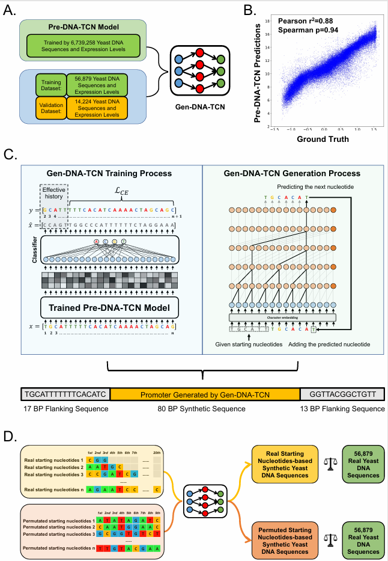

# Synthetic Functional Yeast Promoter Sequence Design Using Autoregressive Language Models
This is a python implementation of the synthetic promoter sequence generation method (namely **Gen-DNA-TCN**) reported in:
```
@article{...,
  title={Synthetic Functional Yeast Promoter Sequence Design Using Autoregressive Language Models},
  author={Alsaggaf, Ibrahim and Freitas, Alex A. and de Magalhães, João Pedro and Wan, Cen},
  journal={...},
  pages={...},
  year={...},
  publisher={...},
  note={Under review}
}
```

<p align="center">
  
</p>

# Usage
This repository contains the implementation of the Gen-DNA-TCN model. The implementation is built in Python3 (version 3.10.12) using Scikit-learn, Levenshtein, and the deep learning library Pytorch.

## Requirements
- torch==2.1.2
- scikit-learn==1.4.0
- Levenshtein==0.26.1
- pandas==2.2.3
- numpy==1.26.4

## Tutorial 
To train the Gen-DNA-TCN (**Model 1**) that directly exploits the embedding layers of the pre-trained Pre-DNA-TCN model from the recent Random Promoter DREAM Challenge [(Rafi et al., 2025)](https://www.nature.com/articles/s41587-024-02414-w) execute:
```
python3 main.py\
 --mode training\
 --model 1\
 --file_train_seq training_sequences.txt\
 --file_val_seq validation_sequences.txt\
 --em_dim 100\
 --out_size 1\
 --c_size 384\
 --max_seq_len 110\
 --k_size 3\
 --stride 1\
 --dropout 0.1\
 --em_dropout 0.1\
 --epochs 1000\
 --b_size 1024\
 --lr 2e-3\
 --hist_len 5\
 --clip 100.0\
 --pre_checkpoint Pre-DNA-TCN.pt\  # The saved checkpoint for the pre-trained Pre-DNA-TCN model from the recent Random Promoter DREAM Challenge
 --device 0\                       # GPU device id if available otherwise ignore\
 --seed 1111\
 --res_path .                      # The path where the results are saved
```
<br/><br/>
To train Gen-DNA-TCN (**Model 2**) that exploits the 56,879 yeast promoter DNA training sequences for both Pre-DNA-TCN model pre-training and for the second stage of the Gen-DNA-TCN model training execute:
```
python3 main.py\
 --mode training\
 --model 2\
 --file_train_seq training_sequences.txt\
 --file_val_seq validation_sequences.txt\
 --em_dim 100\
 --out_size 1\
 --c_size 384\
 --max_seq_len 110\
 --k_size 3\
 --stride 1\
 --dropout 0.1\
 --em_dropout 0.1\
 --epochs 1000\
 --b_size 1024\
 --lr 2e-3\
 --hist_len 5\
 --clip 100.0\
 --pre_checkpoint Pre-DNA-TCN.pt\  # The saved checkpoint for the pre-trained Pre-DNA-TCN model from the first stage of training
 --device 0\                       # GPU device id if available otherwise ignore\
 --seed 1111\
 --res_path .                      # The path where the results are saved
```
> Please note that the code above only runs the second stage of training (i.e. the generative task). To run the first stage of training (i.e. Pre-DNA-TCN pre-training) please see our [submission](https://github.com/de-Boer-Lab/random-promoter-dream-challenge-2022/tree/main/dream_submissions/Wan%26Barton_BBK) for the recent [Random Promoter DREAM Challenge](https://www.nature.com/articles/s41587-024-02414-w).

<br/><br/>
To train Gen-DNA-TCN (**Model 3**) that does not use the pre-trained Pre-DNA-TCN model and directly exploits the 56,879 yeast promoter DNA training sequences to train the Gen-DNA-TCN model execute:
```
python3 main.py\
 --mode training\
 --model 3\
 --file_train_seq training_sequences.txt\
 --file_val_seq validation_sequences.txt\
 --em_dim 100\
 --out_size 1\
 --c_size 384\
 --max_seq_len 110\
 --k_size 3\
 --stride 1\
 --dropout 0.1\
 --em_dropout 0.1\
 --epochs 1000\
 --b_size 1024\
 --lr 2e-3\
 --hist_len 5\
 --clip 100.0\
 --device 0\                       # GPU device id if available otherwise ignore\
 --seed 1111\
 --res_path .                      # The path where the results are saved
```
<br/><br/>
To generate synthetic yeast promoter DNA sequences using the **first type** of starting nucleotides (i.e. starting nucleotides are extracted from the real 56,879 training sequences) execute:
```
python3 main.py\
 --mode inference\
 --model 1\
 --init_type 1\                            # Starting nucleotides are extracted from the real 56,879 training sequences
 --min_n 3\                                # The minimum length of starting nucleotides
 --max_n 20\                               # The maximum length of starting nucleotides
 --file_train_seq training_sequences.txt\
 --sequences_71k sequences_71k.txt\        # Used for removing identical sequences
 --sequences_6m sequences_6m.txt\          # Used for removing identical sequences
 --em_dim 100\
 --out_size 1\
 --c_size 384\
 --max_seq_len 110\
 --k_size 3\
 --stride 1\
 --dropout 0.1\
 --em_dropout 0.1\
 --b_size 1024\
 --pre_checkpoint Pre-DNA-TCN.pt\           # The saved checkpoint for the pre-trained Pre-DNA-TCN model from the recent Random Promoter DREAM Challenge
 --gen_checkpoint Model_1_Gen-DNA-TCN.pt\   # The saved checkpoint for the Gen-DNA-TCN model
 --clf_checkpoint Model_1_clf.pt\           # The saved checkpoint for the Gen-DNA-TCN model classification head
 --res_path .                               # The path where the results are saved
```
<br/><br/>
To generate synthetic yeast promoter DNA sequences using the **second type** of starting nucleotides (i.e. starting nucleotides are made by random permutations) execute:
```
python3 main.py\
 --mode inference\
 --model 1\
 --init_type 2\                            # Starting nucleotides are made by random permutations
 --n 9\                                    # The length of starting nucleotides
 --sequences_71k sequences_71k.txt\        # Used for removing identical sequences
 --sequences_6m sequences_6m.txt\          # Used for removing identical sequences
 --em_dim 100\
 --out_size 1\
 --c_size 384\
 --max_seq_len 110\
 --k_size 3\
 --stride 1\
 --dropout 0.1\
 --em_dropout 0.1\
 --b_size 1024\
 --pre_checkpoint Pre-DNA-TCN.pt\           # The saved checkpoint for the pre-trained Pre-DNA-TCN model from the recent Random Promoter DREAM Challenge
 --gen_checkpoint Model_1_Gen-DNA-TCN.pt\   # The saved checkpoint for the Gen-DNA-TCN model
 --clf_checkpoint Model_1_clf.pt\           # The saved checkpoint for the Gen-DNA-TCN model classification head
 --res_path .                               # The path where the results are saved
```
<br/><br/>
To compute pair-wise Levenshtein distance between real 56,879 training sequences and synthetic yeast promoter DNA sequences generated by model 1 execute:
```
python3 main.py\
 --mode distance\
 --seq1 training_sequences.txt\
 --seq2 Model_1_generated_DNA_sequences_bin_based_sampling.txt\
 --res_path . 
```

## The code
Here we briefly describe each `.py` file in the **code** folder.
`main.py` Runs the proposed Gen-DNA-TCN model.
`models.py` Includes the character-level TCN network implementation.
`train.py` Trains the Gen-DNA-TCN model.
`generate.py` Generates synthetic sequences using the the Gen-DNA-TCN model.
`sample.py` Conducts bin-based and random sampling.
`config.py` and `utils.py` Include some configurations and helper functions.

# Availability
The models' checkpoints and the generated synthetic yeast promoter DNA sequences used in this work can be downloaded from [](https://doi.org/10.5281/zenodo.18182470)

# Acknowledgment
The authors acknowledge the support by the School of Computing and Mathematical Sciences and the Birkbeck GTA programme.
